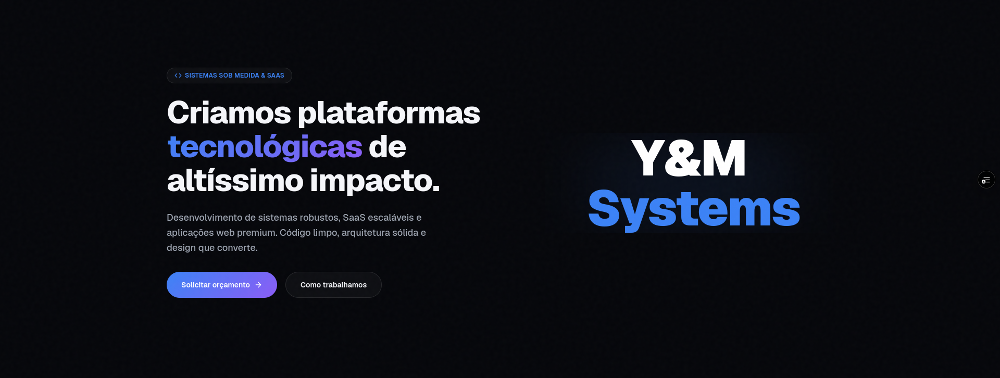

# Y&M SYSTEMS — Landing Page

Landing page institucional desenvolvida para a **Y&M SYSTEMS**, projetada para apresentar a empresa, seus diferenciais, sua filosofia e seus serviços por meio de uma experiência moderna, elegante e altamente responsiva.

O projeto foi construído com foco em **performance**, **experiência do usuário (UX)**, **interface moderna (UI)** e **animações de alta qualidade**, mantendo excelente compatibilidade entre dispositivos desktop e mobile.

---

## Principais características

* Interface moderna e profissional
* Design totalmente responsivo
* Alto desempenho em dispositivos móveis
* Animações otimizadas para diferentes plataformas
* Navegação fluida
* Seções organizadas para apresentação institucional
* Formulário de contato
* Layout pensado para conversão e apresentação comercial

---

## Tecnologias utilizadas

O projeto foi desenvolvido utilizando tecnologias modernas do ecossistema JavaScript, priorizando desempenho, escalabilidade e uma excelente experiência de desenvolvimento.

* **React** — Construção da interface baseada em componentes reutilizáveis.
* **TypeScript** — Tipagem estática para maior segurança e manutenção do código.
* **Next.js** — Framework React utilizado para estruturação, otimização e renderização da aplicação.
* **Tailwind CSS** — Estilização utilitária para desenvolvimento rápido e consistente.
* **CSS** — Estilos personalizados e ajustes específicos da interface.
* **GSAP (GreenSock Animation Platform)** — Criação de animações avançadas, transições e microinterações de alta performance.

---

## Responsividade

A landing page foi desenvolvida para proporcionar uma ótima experiência em:

* Desktop
* Notebook
* Tablet
* Smartphones Android
* iPhone (iOS)

Durante o desenvolvimento foram realizadas diversas otimizações específicas para dispositivos móveis, reduzindo o consumo de CPU, GPU e memória sem comprometer a identidade visual da aplicação.

---

## Performance

O projeto recebeu uma etapa dedicada de otimização para garantir:

* Scroll fluido
* Redução de processamento durante a navegação
* Baixo consumo de memória
* Melhor gerenciamento das animações
* Renderização eficiente em dispositivos móveis
* Carregamento mais rápido

As animações foram cuidadosamente balanceadas para preservar a experiência visual enquanto reduzem significativamente a carga computacional em smartphones.

---

## Objetivo

Esta landing page tem como objetivo representar a identidade da **Y&M SYSTEMS**, transmitindo inovação, tecnologia e profissionalismo por meio de uma experiência visual envolvente, moderna e eficiente.

---

## Licença

Este projeto foi desenvolvido para a **Y&M SYSTEMS**.

Todos os direitos reservados.

---

## Desenvolvido por

**Y&M SYSTEMS**

Construindo soluções digitais modernas, performáticas e escaláveis.
